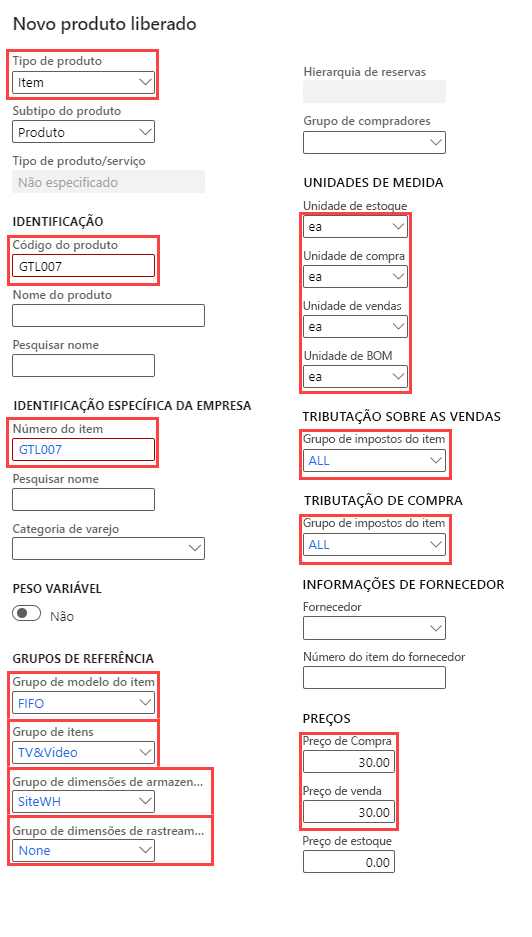

---
lab:
    title: 'Laboratório 3: Criar uma oferta de produto com vários tamanhos e cores'
    module: 'Módulo 1: Conheça os Princípios básicos do Microsoft Dynamics 365 Supply Chain Management'
---

# Módulo 1: Conheça os Princípios básicos do Dynamics 365 Supply Chain Management

## Laboratório 3 - Criar uma oferta de produto com vários tamanhos e cores

## Objetivos

Na Contoso Entertainment System USA (USMF), você precisa criar um novo item para uma nova configuração de armário a ser comprado dos fornecedores.

## Configuração do laboratório

   - **Tempo estimado**: 10 minutos

## Instruções

1. Na home page do Finance and Operations, na parte superior direita, verifique se você está trabalhando com a empresa USMF.

1. Se necessário, selecione a empresa e, no menu, selecione **USMF**.

1. Na parte superior esquerda, selecione o menu de hambúrguer **Expandir o painel de Navegação**.

1. No painel de navegação, selecione **Módulos** > **Gerenciamento de informações do produto** e, em seguida, na categoria **Produtos**, selecione **Produtos liberados**.

1. Na página Detalhes do produto liberado, no menu superior, selecione **+ Novo**.

1. No painel Novo produto liberado, no menu **Tipo de produto**, verifique se a opção **Item** está selecionada.

1. No menu **Subtipo do produto**, verifique se a opção **Produto** está selecionada.

1. Selecione o menu **Grupo de dimensões de rastreamento** e, em seguida, selecione **Nenhum**.

1. Em **IDENTIFICAÇÃO**, nas caixas **Número do produto** e **Número do item**, digite **GTL007**.

1. Na caixa **Nome do produto**, digite **Armário 2**.

1. Em **GRUPOS DE REFERÊNCIA**, selecione o menu **Grupo de modelo do item** e, em seguida, **FIFO Primeiro a entrar, primeiro a sair**.

1. Selecione o menu **Grupo de itens** e, em seguida, **TV e Vídeo**.

1. Selecione o menu **Grupo de dimensões de armazenamento** e, em seguida, **SiteWH**.

1. Em **UNIDADES DE MEDIDAS**, verifique se os seguintes valores estão definidos:

    | **Configuração**| **Valor**|
    | :--- | :--- |
    | Unidade de estoque| cd Cada|
    | Unidade de compra| cd Cada|
    | Unidade de venda| cd Cada|
    | Unidade de BOM| cd Cada|

1. Em **TRIBUTAÇÃO SOBRE AS VENDAS**, selecione o menu **Grupo de impostos do item** e, em seguida, **TUDO**.

1. Em **TRIBUTAÇÃO DE COMPRA**, selecione o menu **Grupo de impostos do item** e, em seguida **TUDO**.

1. Em PREÇOS, na caixa Preço de compra, digite 30,00.

1. Na caixa Preço de vendas, digite 30,00.

1. O novo produto liberado deve ser parecido com este:

    

1. Selecione **OK**.

1. Para assegurar a finalização do produto, na barra da faixa de opções, em **Manter**, selecione **Validar**.

    

1. Verifique se é apresentada a faixa de informações confirmando que todos os valores de campo necessários foram validados.

    

1. Feche todas as páginas e volte para a home page.
