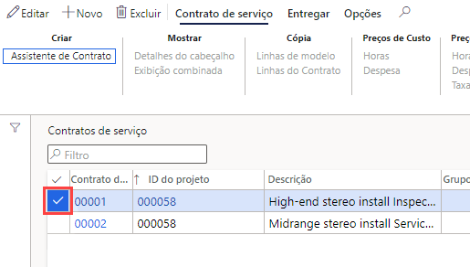
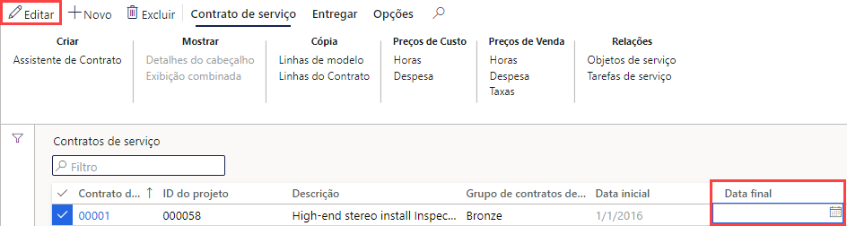

---
lab:
    title: 'Laboratório 7: Criar uma ordem de serviço planejada'
    module: 'Módulo 1: Conheça os Princípios básicos do Microsoft Dynamics 365 Supply Chain Management'
---

## Laboratório 7 - Criar uma ordem de serviço planejada

## Objetivos

As ordens de serviço feitas no sistema descrevem a manutenção ou os reparos que são necessários em um ativo e são usadas para atribuir os recursos apropriados à conclusão da solicitação de manutenção. Sua empresa tem um contrato de serviço contínuo e precisa ter certeza de que ordens de serviço planejadas sejam criadas para dar suporte à manutenção esperada de itens do contrato.

## Configuração do laboratório

   - **Tempo estimado**: 10 minutos

## Instruções

1. Na home page do Finance and Operations, na parte superior direita, verifique se você está trabalhando com a empresa USMF.

1. Se necessário, selecione a empresa e, no menu, selecione **USMF**.

1. No painel de navegação à esquerda, selecione **Módulos** > **Gerenciamento de serviços** > **Contratos de serviço** > **Contratos de serviço**.

1. Marque a caixa de seleção na primeira coluna do primeiro contrato de serviço.

    

1. Selecione a caixa **Data de término**, exclua o valor atual e, em seguida, no menu superior, selecione **Salvar**.  
 A data de término está sendo removida para que seja possível criar uma nova ordem de serviço para este contrato.

    

1. No menu superior, selecione **Entrega**.

1. Na barra da faixa de opções, em **Criar**, selecione **Ordens de serviço planejadas**.

1. No painel Criar ordens de serviço, em **PERÍODO**, defina **De** como a data de hoje e **Até** como dois dias depois de hoje.

1. Em **LOG DE INFORMAÇÕES**, selecione o botão de alternância **Mostrar log de informações** e defina-o como **Sim**.  
Assim, será exibida uma lista das ordens de serviço criadas no contrato.

1. Em **INCLUIR TIPOS DE TRANSAÇÃO**, selecione o **Hour** botão de alternância para defini-lo como **Sim**.  
Os tipos de transação representam as linhas criadas no contrato de serviço. Cada tipo de transação selecionado gera várias ordens de serviço, dependendo do intervalo especificado na linha do contrato de serviço.

1. Em **OPÇÃO**, selecione o botão de alternância **Contínuo** e defina-o como **Sim**.  
Ele é usado para criar ordens de serviço que estejam faltando de uma série contínua de ordens de serviço.

1. Selecione **OK**.
